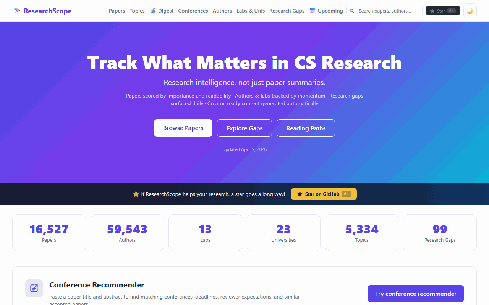

<div align="center">

# ResearchScope

**Research intelligence for CS papers — track what matters, who drives it, what to read first.**

Stop skimming paper lists. ResearchScope scores, tags, and surfaces the papers that actually move your field.

[](https://kishormorol.github.io/ResearchScope/)
[](LICENSE)
[](https://www.python.org/)
[](.github/workflows)
[](https://arxiv.org)

<br/>



</div>

---

## What is ResearchScope?

ResearchScope is an **open, static research intelligence dashboard** for computer science papers.
It is **not** primarily a CLI tool — it is a website that is rebuilt daily by a GitHub Actions
pipeline and published to GitHub Pages.

The pipeline fetches papers from **arXiv** and **ACL Anthology**, enriches them with scores and
tags, detects research gaps, and writes the results as static JSON + HTML to the `site/` folder.
The site then renders everything from those JSON files in the browser — no server required.

---

## What's New in ResearchScope

| Version | Highlight |
|---|---|
| 🆕 **My Library** | Save papers to a personal library stored in your browser (localStorage). Access saved papers anytime from the Papers page — no account or backend required. |
| **Conference Recommender** | Paste a title and abstract to get ranked venue matches with deadlines and reviewer expectations. |
| **Daily arXiv fetch** | Pipeline now fetches from all arXiv sources and surfaces the top 500 papers by score daily. |

---

## Features

| Feature | Description |
|---|---|
| 📄 **Paper intelligence** | Papers from arXiv & ACL Anthology scored by recency, citation momentum, and relevance |
| 👩‍🔬 **Author / lab intelligence** | Track prolific authors and their recent output |
| 🗺 **Learning paths** | Curated reading paths tagged by topic and difficulty level |
| 🔍 **Research gap explorer** | Surface under-explored areas and emerging directions |
| 🎯 **Conference recommender** | Paste a title and abstract to get ranked venue matches, deadlines, reviewer expectations, and similar accepted papers |
| 📚 **My Library** | Save papers to a personal browser-local library with FIFO ordering and persistent state across reloads |
| 🖥 **Static dashboard** | Zero-backend site hosted on GitHub Pages, updated daily |

---

## Data Sources (MVP)

| Source | Content |
|---|---|
| **arXiv** | Preprints across CS, ML, NLP, CV, and related fields |
| **ACL Anthology** | Peer-reviewed NLP / CL papers from ACL, EMNLP, NAACL, and others |

---

## Architecture

```
┌─────────────────────────────────────┐
│          GitHub Actions              │
│  (runs daily via cron schedule)      │
│                                      │
│  src/pipeline.py                     │
│    ├── connectors/   arXiv + ACL     │
│    ├── scoring/      read-next rank  │
│    ├── tagging/      topic tags      │
│    ├── difficulty/   reading level   │
│    ├── gaps/         gap detection   │
│    └── sitegen/      → data/*.json   │
└──────────────┬──────────────────────┘
               │ commits data/
               ▼
        site/  (GitHub Pages)
          index.html   – dashboard homepage
          papers.html  – full paper list
          authors.html – author profiles
          gaps.html    – research gap explorer
          topics.html  – topic browser
          labs.html    – lab profiles
          assets/      – CSS + JS
          data/ (symlink / copied) ← JSON from pipeline
```

## Project Layout

```
.github/workflows/update.yml   # daily pipeline + Pages deployment
src/
  pipeline.py                  # orchestrates all stages
  connectors/                  # arXiv & ACL Anthology fetchers
  scoring/                     # read-next scoring
  tagging/                     # topic tagging
  difficulty/                  # difficulty assessment
  gaps/                        # research gap extraction
  sitegen/                     # writes data/*.json for the site
site/
  index.html                   # homepage (published to GitHub Pages)
  papers.html / authors.html … # sub-pages
  conference-recommender.html  # venue recommender (static, JS-powered)
  library.html                 # My Library page (localStorage-backed)
  assets/css/ assets/js/       # static assets
data/                          # generated JSON (committed by CI)
tests/                         # pytest test suite
```

## Local Development

```bash
# Clone and install
git clone https://github.com/kishormorol/ResearchScope.git
cd ResearchScope

python -m venv .venv
source .venv/bin/activate    # Windows: .venv\Scripts\activate
pip install -r requirements.txt

# Run the pipeline locally (writes JSON to data/)
python src/pipeline.py

# Run tests
python -m pytest tests/ -v

# Open the site locally (serve site/ with any static server)
cd site && python -m http.server 8080
```

## GitHub Pages Deployment

The workflow in `.github/workflows/update.yml`:

1. Runs the Python pipeline to fetch and process papers.
2. Commits any changed JSON files in `data/`.
3. Uploads the `site/` folder as a GitHub Pages artifact and deploys it.

To enable Pages for a fork: go to **Settings → Pages** and set the source to
**GitHub Actions**.

## Contributing

See [CONTRIBUTING.md](CONTRIBUTING.md) for guidelines.

## Acknowledgments

ResearchScope aggregates metadata from the following open academic resources. We are grateful to each for making their data publicly accessible.

| Source | What we use | License |
|---|---|---|
| [arXiv](https://arxiv.org) | Paper metadata (title, abstract, authors, categories) | Metadata: CC0 (public domain) |
| [ACL Anthology](https://aclanthology.org) | NLP/CL paper metadata via `anthology+abstracts.bib.gz` | 2016+: CC BY 4.0 · Pre-2016: CC BY-NC-SA 3.0 |
| [PMLR](https://proceedings.mlr.press) | ICML proceedings metadata | CC BY 4.0 |
| [Semantic Scholar](https://www.semanticscholar.org) | Conference paper metadata and author affiliations | See [S2 API License](https://www.semanticscholar.org/product/api/license) |

ResearchScope stores only bibliographic metadata (titles, abstracts, authors, affiliations, URLs). No full paper text or PDFs are stored or redistributed. All papers link back to their original sources.

If you are a publisher and have concerns about how your content is represented, please [open an issue](https://github.com/kishormorol/ResearchScope/issues).

## Contributors

Thanks to everyone who has contributed to ResearchScope!

[](https://github.com/kishormorol/ResearchScope/graphs/contributors)

| Contributor | GitHub | Commits |
|---|---|---|
| Md Kishor Morol | [@kishormorol](https://github.com/kishormorol) | Project lead · architecture · pipeline |
| Shadril Hassan | [@shadril238](https://github.com/shadril238) | Contributor |
| Saad Chowdhury | [@0Sa-ad0](https://github.com/0Sa-ad0) | Contributor |

Want to contribute? See [CONTRIBUTING.md](CONTRIBUTING.md).

---

## License

MIT © 2026 Md Kishor Morol
