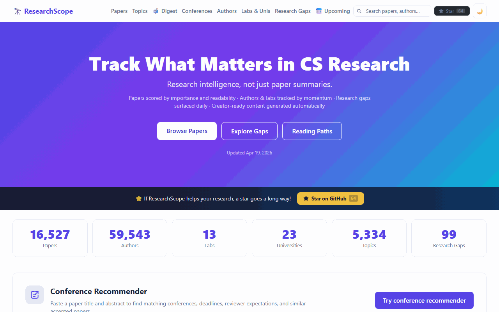

<div align="center">

# ResearchScope

**CS Research Intelligence Platform — 100,000+ papers, scored, ranked, and searchable.**

Stop skimming paper lists. ResearchScope scores papers by impact, surfaces research gaps, recommends venues, and tracks who's driving the frontier — updated daily.

[](https://kishormorol.github.io/ResearchScope/)
[](https://researchscope-production.up.railway.app/docs)
[](https://huggingface.co/datasets/kishormorol/researchscope-papers)
[](LICENSE)
[](https://www.python.org/)
[](.github/workflows)

<br/>



</div>

---

## What is ResearchScope?

ResearchScope is an **open research intelligence platform** for computer science and AI. A daily GitHub Actions pipeline fetches papers from **6 data sources** (arXiv, OpenAlex, ACL Anthology, OpenReview, PMLR, CVF, Semantic Scholar), enriches them with multi-signal scores, detects research gaps, and syncs to two backends:

- **Railway PostgreSQL** — full dataset, powers the REST API with full-text search and live browser queries
- **Hugging Face Hub** — public JSONL dataset for LLM training

The frontend is a static site on GitHub Pages backed by a **FastAPI REST API** on Railway.

👉 **[Open ResearchScope](https://kishormorol.github.io/ResearchScope/)** · 📖 **[API Docs](https://researchscope-production.up.railway.app/docs)**

---

## Install the CLI

The `researchscope` package ships a lightweight command-line tool for searching, saving, and analysing papers locally. It requires **Python 3.10+**.

```bash
pip install researchscope
```

This installs the `researchscope` command. Run it with no arguments to see all commands and options:

```bash
researchscope --help
```

### Usage

**Search** arXiv (or Semantic Scholar) and print ranked results:

```bash
# Top 10 arXiv results for a query
researchscope search "graph neural networks"

# Limit results and save them to a local store for later analysis
researchscope search "diffusion models" --limit 25 --save

# Use Semantic Scholar as the source
researchscope search "retrieval augmented generation" --source semantic_scholar
```

**List** the papers you've saved locally:

```bash
researchscope list-papers          # all saved papers, ranked
researchscope list-papers --limit 20
```

**Gaps** — surface the least-covered topics across your saved papers:

```bash
researchscope gaps                 # top 10 gap topics
researchscope gaps --top-n 25
```

> **Note:** `search --save` persists results to a local store first; `list-papers` and `gaps` operate on those saved papers. Run a save before using them.

> The CLI is a self-contained prototype. The full ResearchScope platform — 100K+ papers, venue recommenders, and the web dashboard — lives at the links above and in [`src/`](src/).

---

## What's New

| Date | Highlight |
|---|---|
| **Jul 2026** | **Three-theme interface** — pick **Atelier Zero** (warm editorial), **Industrial Brutalist** (high-contrast), or **Field Notes** (tactile) from the nav; selection persists across pages and reloads with no flash. Rebuilt responsive navigation + modular CSS architecture |
| **Jun 2026** | **OpenReview Acceptance Tiers** — oral/spotlight/poster signals captured for ICLR, NeurIPS, ICML & COLM; oral/spotlight boost paper scores and show as badges. Coverage extended through ICLR 2026, NeurIPS 2025, ICML 2025 |
| **Jun 2026** | **Journal Recommender** — paste title + abstract to match against 20 Q1 journals (JMLR, TPAMI, Nature MI, CSUR…) with impact factor, review timeline, and open access info |
| **Jun 2026** | **FastAPI Backend on Railway** — full REST API with JWT auth, favourites, PostgreSQL full-text search (100K+ papers). User accounts synced across devices |
| **Jun 2026** | **OpenAlex Integration** — 250M+ work catalogue added as a data source, covering ML/NLP/CV/IR concept groups |
| **Jun 2026** | **HuggingFace Training Dataset** — `kishormorol/researchscope-papers` auto-pushed after every pipeline run: raw metadata JSONL + instruction-tuning pairs |
| **Jun 2026** | **20 Q1 Journals** — JMLR, TMLR, TACL, TPAMI, IJCV, AIJ, TNNLS, Nature MI, CSUR, TIP, MLJ, TKDE, DAMI, NN, PR, CL, IPM, JACM, NatComms, TOIS |
| **May 2026** | **Complete A* Coverage** — AAAI, IJCAI, CHI, SIGIR, WWW, KDD, WSDM, SIGMOD, ICSE bulk-fetched via Semantic Scholar |
| **Apr 2026** | **Conference Recommender** — TF-IDF venue matching with deadline info and reviewer expectations |
| **Apr 2026** | **CiteLens Integration** — one-click citation analysis for any arXiv paper |

---

## Features

| Feature | Description |
|---|---|
| 📄 **100K+ papers** | Scored by recency, venue rank, acceptance tier (oral/spotlight), novelty, author prestige, and citation quality |
| 🎓 **A* Conference coverage** | NeurIPS, ICML, ICLR, CVPR, ACL, EMNLP, AAAI, IJCAI, CHI, SIGIR, WWW, KDD and more |
| 📖 **20 Q1 Journals** | JMLR, TMLR, TACL, TPAMI, Nature MI, and 15 more — with IF, review time, OA status |
| 🎯 **Venue Recommenders** | Conference + Journal recommenders: paste abstract → ranked matches with expectations |
| ⏰ **Deadline tracker** | Live countdowns to A*/A conference deadlines across 10 CS areas — abstract, paper, and notification dates |
| 🔍 **Full-text search** | PostgreSQL `tsvector` search across 100K+ papers via Railway API |
| 👤 **User accounts** | JWT auth, favourites synced across devices via Railway backend |
| 💬 **Chat with Paper** | Authenticated split-screen PDF chat with page citations and cross-device history (provider-configured) |
| 🕳 **Research gaps** | 3-layer extraction: explicit, pattern-detected, and starter ideas |
| 👩‍🔬 **Author intelligence** | 5,000+ researchers ranked by momentum score |
| 🤗 **LLM training data** | `papers.jsonl` + `instruct.jsonl` on HuggingFace Hub |
| 🔗 **CiteLens** | One-click handoff to citation analysis for arXiv papers |
| 🎨 **Three themes** | Atelier Zero, Industrial Brutalist, and Field Notes — switch from the nav, persists with no flash |

### ⏰ Conference Deadline Tracker

Live countdowns to top CS conference deadlines — filter by area, track abstract vs. paper deadlines, and review past cycles.


---

## Architecture

```
┌──────────────────────────────────────────────────────────────────────┐
│                         GitHub Actions                               │
│              daily (weekdays) + monthly (conference sync)            │
│                                                                      │
│  src/pipeline.py — 11 stages                                         │
│    ├── connectors/   arXiv · OpenAlex · ACL · OpenReview · PMLR     │
│    │                 CVF · Semantic Scholar                           │
│    ├── dedup/        Jaccard title-similarity dedup                   │
│    ├── tagging/      80+ topic tags + paper_type                     │
│    ├── difficulty/   L1–L4 reading level                             │
│    ├── scoring/      4 scores + author momentum                      │
│    ├── content/      summaries, key contributions, why-it-matters    │
│    ├── clustering/   topic grouping                                   │
│    ├── gaps/         3-layer research gap extraction                 │
│    ├── aggregation/  author, lab, university profiles                │
│    └── sitegen/      → site/data/*.json                              │
│                      → Railway PostgreSQL upsert (API backend)       │
│                      → HuggingFace Hub push (JSONL dataset)          │
└────────┬─────────────────────────┬──────────────────────────────────┘
         │ commits + deploys       │ syncs                │ pushes
         ▼                         ▼                      ▼
  GitHub Pages              Railway PostgreSQL      HuggingFace Hub
  (static site)             FastAPI REST API        researchscope-papers
                            /papers /search          papers.jsonl
                            /auth   /favourites      instruct.jsonl
                            /docs   (Swagger UI)
         ▲                         ▲
         │ reads static JSON       │ Railway API (→ static JSON fallback)
         └─────────────────────────┘
              Frontend (browser)
```

---

## API

The REST API is live at **`https://researchscope-production.up.railway.app`**.

| Method | Endpoint | Description |
|---|---|---|
| `GET` | `/papers` | Paginated papers — filter by `venue`, `year`, `source_type`, `tag` |
| `GET` | `/papers/conferences` | Conference papers only |
| `GET` | `/papers/journals` | Journal papers only |
| `GET` | `/papers/{id}` | Single paper |
| `GET` | `/search?q=...` | PostgreSQL full-text search |
| `POST` | `/auth/register` | Create account → JWT |
| `POST` | `/auth/login` | Login → JWT |
| `GET` | `/auth/me` | Current user |
| `GET` | `/favourites` | Saved papers (auth required) |
| `POST` | `/favourites/{id}` | Save paper |
| `DELETE` | `/favourites/{id}` | Remove saved paper |
| `GET/POST` | `/papers/{id}/document-status`, `/prepare` | Inspect or prepare a PDF for grounded chat |
| `GET/POST` | `/chat/sessions` | List or create user-owned paper chats |
| `POST` | `/chat/sessions/{id}/messages` | Stream a cited answer with server-sent events |
| `POST` | `/pipeline/trigger` | Trigger pipeline via GitHub Actions |

Interactive docs: **[/docs](https://researchscope-production.up.railway.app/docs)**

---

## LLM Training Dataset

The paper dataset is published on HuggingFace and auto-updated after every pipeline run.

```python
from datasets import load_dataset

# 100K+ raw paper records (pretraining / RAG)
papers = load_dataset("kishormorol/researchscope-papers",
                      data_files="data/papers.jsonl", split="train")

# Instruction-tuning pairs (summarize, key contribution, why it matters…)
instruct = load_dataset("kishormorol/researchscope-papers",
                        data_files="data/instruct.jsonl", split="train")
```

→ **[huggingface.co/datasets/kishormorol/researchscope-papers](https://huggingface.co/datasets/kishormorol/researchscope-papers)**

---

## Data Sources

| Source | Content | Frequency |
|---|---|---|
| **arXiv (OAI-PMH)** | All cs.* preprints — 19 CoRR categories | Daily |
| **OpenAlex** | 250M+ works — ML/NLP/CV/IR concept groups | Daily |
| **ACL Anthology** | ACL, EMNLP, NAACL, EACL, COLING, TACL, CL (2020+) | Monthly |
| **OpenReview** | ICLR (2022–26), NeurIPS (2022–25), ICML (2024–25), COLM (2024–25) — with oral/spotlight/poster acceptance tiers | Monthly |
| **PMLR** | ICML (2020–25), AISTATS (2021–25), UAI (2021–24) | Monthly |
| **CVF** | CVPR (2021–25), ICCV (2021+23), ECCV (2020+22+24) | Monthly |
| **Semantic Scholar** | AAAI, IJCAI, KDD, WWW, SIGIR, WSDM, CHI, SIGMOD, ICSE + journals | Monthly |

---

## Project Layout

```
.github/workflows/
  pipeline.yml            # daily arXiv + OpenAlex pipeline
  conference-sync.yml     # monthly full conference + journal sync
  backfill.yml            # manual historical backfill
  discord-potd.yml        # daily Paper of the Day → Discord
backend/                  # FastAPI REST API (deployed on Railway)
  app/
    main.py               # FastAPI app with CORS, lifespan
    database.py           # async SQLAlchemy + asyncpg
    models.py             # Paper, User, Favourite ORM models
    schemas.py            # Pydantic v2 schemas
    auth.py               # JWT + bcrypt
    routers/
      papers.py           # GET /papers /conferences /journals
      search.py           # GET /search (PostgreSQL full-text)
      auth.py             # POST /auth/register /login GET /me
      favourites.py       # GET POST DELETE /favourites
      pipeline.py         # POST /pipeline/trigger
  requirements.txt
  railway.toml
src/
  pipeline.py             # 11-stage orchestrator
  connectors/
    arxiv_connector.py
    openalex_connector.py # NEW — 250M+ OpenAlex works
    acl_connector.py
    openreview_connector.py
    pmlr_connector.py
    cvf_connector.py
    semantic_scholar_connector.py
  storage/
    railway_store.py      # Railway PostgreSQL upsert
    hf_dataset.py         # HuggingFace Hub push
  sitegen/
    generator.py
    conference_recommender.py
    journal_recommender.py  # NEW — 20 Q1 journals
config/
  venues.yaml             # conferences + journals registry
  topics.yaml             # topic taxonomy
  weights.yaml            # tuneable score weights
site/                     # static frontend (GitHub Pages)
  index.html              # homepage
  papers.html             # paper browser
  conferences.html        # A* conference papers
  journals.html           # Q1 journal papers
  journal-recommender.html    # NEW
  conference-recommender.html
  topics.html / authors.html / labs.html
  gaps.html / digest.html / deadlines.html
  search.html / favourites.html / library.html
  assets/js/
    app.js                # shared utilities + dropdown nav
    railway-api.js        # Railway API data client + auth
tests/                    # pytest suite (110+ tests)
```

---

## Local Development

```bash
# Clone and install
git clone https://github.com/kishormorol/ResearchScope.git
cd ResearchScope
python -m venv .venv && source .venv/bin/activate
pip install -r requirements.txt

# Run the full pipeline locally
python src/pipeline.py

# Conference + journal sync only
python src/pipeline.py --conferences-only

# Run tests
python -m pytest tests/ -v

# Serve the frontend
cd site && python -m http.server 8080

# Serve the frontend with production-style extensionless routes (from the repository root)
cd .. && python scripts/serve_site.py --port 8080

# Run the API locally
cd backend
pip install -r requirements.txt
DATABASE_URL=postgresql://... uvicorn app.main:app --reload

# Alternatively, use DATABASE_URL from the repository-root .env
uvicorn app.main:app --reload
```

The local API loads the repository-root `.env` without overriding variables
already supplied by the shell or deployment environment.

### Environment variables

| Variable | Where | Description |
|---|---|---|
| `RAILWAY_DATABASE_URL` | GH Secret | Public Railway PostgreSQL URL (pipeline sync) |
| `DATABASE_URL` | Railway Env | Same URL for FastAPI backend |
| `JWT_SECRET` | Railway Env | Secret key for JWT signing |
| `HF_TOKEN` | GH Secret | HuggingFace write token for dataset push |
| `SEMANTIC_SCHOLAR_API_KEY` | GH Secret | Raises S2 rate limit 1→10 req/s |
| `OPENREVIEW_EMAIL` | GH Secret | For OpenReview authenticated access |
| `OPENREVIEW_PASSWORD` | GH Secret | For OpenReview authenticated access |
| `DISCORD_WEBHOOK_URL` | GH Secret | Paper of the Day → Discord |
| `PIPELINE_SECRET` | Both | Shared secret for `/pipeline/trigger` endpoint |
| `GITHUB_TOKEN` | Railway Env | Fine-grained PAT for triggering workflows |
| `CHAT_ENABLED` | Railway Env | Feature flag; defaults to `false` |
| `OPENAI_API_KEY` | Railway Env | Server-side key for Chat with arXiv; never expose it to the browser |
| `OPENAI_CHAT_MODEL` | Railway Env | Optional model override; defaults to `gpt-5.6-terra` |
| `OPENAI_REASONING_EFFORT` | Railway Env | Optional reasoning level; defaults to `low` for lower cost and latency |

Chat semantic ranking runs inside PostgreSQL. Standard Railway PostgreSQL uses
the compatible `REAL[]` cosine query; a Railway pgvector database automatically
adds an HNSW index for the default 256-dimension embeddings without rewriting or
deleting existing embedding data.

---

## Works with CiteLens

ResearchScope and [CiteLens](https://kishormorol.github.io/CiteLens/) are companion tools:

```
ResearchScope ──── "Here's a paper worth reading today"
                           │
                 🔍 Analyze citations
                           ▼
CiteLens ────── "Here's who cited it and why it mattered"
                           │
               🔭 Browse topic in ResearchScope
                           ▼
ResearchScope ──── "Discover more papers on this topic"
```

---

## Comparison

| Tool | Free | Open source | Daily updates | Gaps | Venue recommender | API | No sign-up |
|---|---|---|---|---|---|---|---|
| **ResearchScope** | ✅ | ✅ | ✅ | ✅ | ✅ Conference + Journal | ✅ | ✅ |
| Arxiv Sanity | ✅ | ✅ | ✅ | ❌ | ❌ | ❌ | ✅ |
| Papers With Code | ✅ | ❌ | ✅ | ❌ | ❌ | Partial | ✅ |
| Semantic Scholar | ✅ | ❌ | ✅ | ❌ | ❌ | ✅ | ✅ |
| Elicit | Partial | ❌ | ❌ | ❌ | ❌ | ❌ | ❌ |

---

## Acknowledgments

| Source | License |
|---|---|
| [arXiv](https://arxiv.org) | Metadata: CC0 |
| [OpenAlex](https://openalex.org) | CC0 |
| [ACL Anthology](https://aclanthology.org) | CC BY 4.0 |
| [PMLR](https://proceedings.mlr.press) | CC BY 4.0 |
| [Semantic Scholar](https://www.semanticscholar.org) | S2 API License |
| [OpenReview](https://openreview.net) | Public API |
| [CVF](https://openaccess.thecvf.com) | Public access |

ResearchScope stores only bibliographic metadata — no full text or PDFs.

The statement above describes the public dataset. When Chat with Paper is enabled, the authenticated backend may fetch an allowlisted PDF, discard the PDF bytes after processing, and persist page-aware extracted text chunks for grounded answers. User conversations remain private to their account until deleted.

---

## Contributors

[](https://github.com/kishormorol/ResearchScope/graphs/contributors)

| Contributor | GitHub | Role |
|---|---|---|
| Md Kishor Morol | [@kishormorol](https://github.com/kishormorol) | Project lead · architecture · pipeline |
| Mohammed Efaz | [@WhiteHades](https://github.com/WhiteHades) | Multi-theme UI · frontend architecture |
| Shadril Hassan | [@shadril238](https://github.com/shadril238) | Topic network graph |
| Saad Chowdhury | [@0Sa-ad0](https://github.com/0Sa-ad0) | Contributor |

Want to contribute? See [CONTRIBUTING.md](CONTRIBUTING.md).

---

## License

MIT © 2026 Md Kishor Morol
